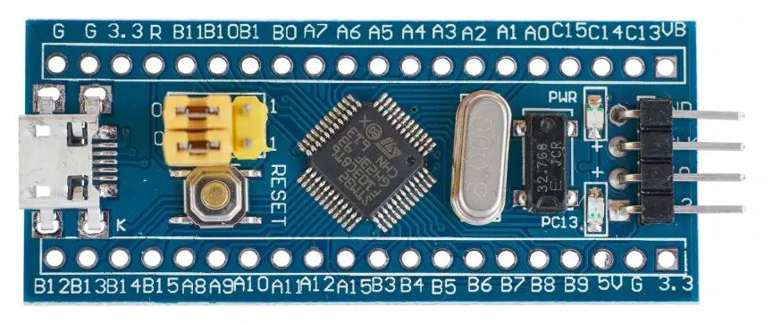
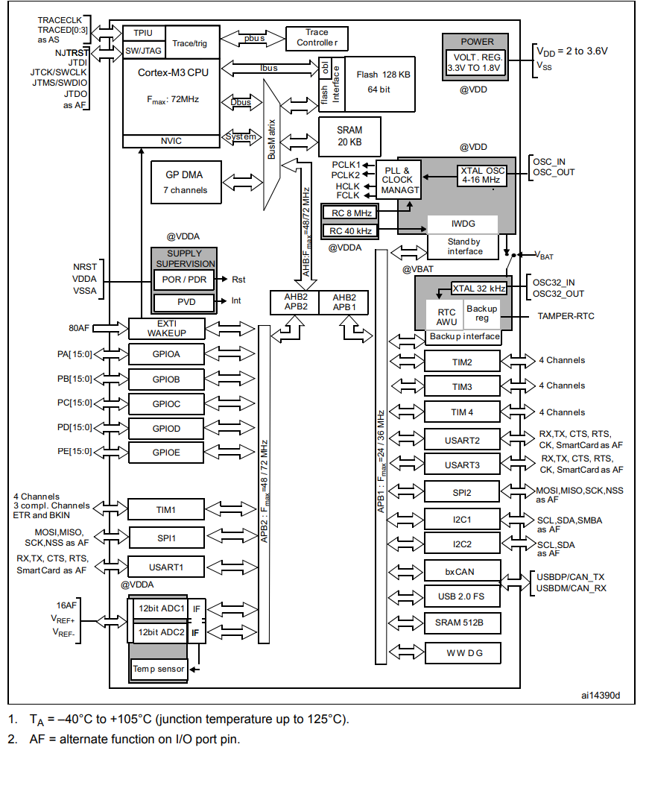
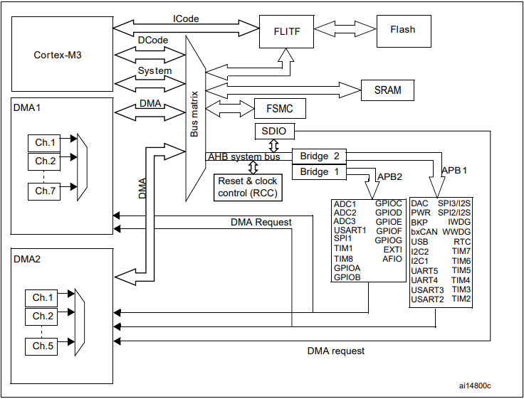

<h3>Navigation Menu</h3>
<ul>
  <li><a href="Learning%20Outcomes.md">Learning Outcomes</a></li>
  <li><a href="P1_WhatIsBareMetalProgramming.md">P1_WhatIsBareMetalProgramming</a></li>
  <li><a href="P3_Registers&MemoryMap.md">P3_Registers&MemoryMap</a></li>
  <li><a href="P4_Datasheets&RefManuals.md">P4_Datasheets&RefManuals</a></li>
  <li><a href="P5_ToolchainOverview.md">P5_ToolchainOverview</a></li>
  <li><a href="CodeExamples.md">CodeExamples</a></li>
</ul>

---
# PART 2: Anatomy of a Microcontroller

Before we can program a microcontroller at the register level, we need to understand how it's internally organised. This section breaks down a typical MCU block diagram and explains the essential building blocks you'll encounter across most platforms (like STM32, AVR, MSP430, etc.).

---

## Typical Microcontroller Block Diagram

---
## What are the Key Components?

### 1. CPU Core

- The brain of the MCU. Executes instructions from your program.
- Common cores: ARM Cortex-M0/M3/M4, AVR, RISC-V, etc.
- Handles interrupts, arithmetic, logic, and program flow.

---
### 2. Flash Memory

- Stores your compiled program (non-volatile).
- You flash your binary here via a programmer/debugger.

---
### 3. SRAM (Static RAM)

- Stores variables, stack, and runtime data.
- Volatile—cleared when the device resets or powers off.

---
### 4. Clock System

- Provides timing signals to the entire chip.
- Sources: internal RC oscillator, external crystal, PLL (Phase Locked Loop).
- Critical for setting up peripherals and processor speed.

**Common terms:**

| Term     | Description                        |
|----------|------------------------------------|
| HSI      | High-Speed Internal Oscillator     |
| HSE      | High-Speed External crystal        |
| SYSCLK   | System Clock                       |
| AHB/APB  | Clock buses for peripherals        |

---
### 5. GPIO (General Purpose I/O)

- Digital input/output pins.

- Can be configured for:
  - Input (buttons)
  - Output (LEDs)
  - Alternate Function (UART, SPI, etc.)

- Each GPIO port is usually connected to:
  - A MODER register (mode: input/output/alternate)
  - An ODR register (output data)
  - An IDR register (input data)

---
### 6. Timers & Counters

- Measure time, generate delays, create PWM signals.

**Common features:**
- One-shot or periodic timing
- Compare & capture modes
- Input edge detection

---
### 7. Interrupt Controller (NVIC)

- Handles interrupts from peripherals.
- Lets you pause main code to respond to events (like button press or UART input).
- Essential for low-latency systems.

---
### 8. Communication Interfaces

| Peripheral | Use Case                                              |
|------------|------------------------------------------------------|
| UART       | Serial communication (e.g., with PC, sensors)        |
| SPI        | Fast synchronous data transfer (e.g., displays, sensors) |
| I²C        | Communicates with multiple devices on a shared bus   |
| CAN        | Used in automotive and industrial control systems    |

These interfaces often share pins via pin multiplexing (more below).

---
### 9. ADC (Analogue-to-Digital Converter)

- Converts analogue voltages (like from sensors) into digital numbers.

**Key settings:**
- Resolution (e.g., 10-bit, 12-bit)
- Sampling time
- Input channel

---
### 10. Pin Multiplexing

- Most MCU pins have multiple possible functions.
- Example: Pin A2 might be GPIO, UART TX, or ADC input.
- Function is selected using AF (Alternate Function) registers.

---
## Bus Architecture

- AHB/APB buses connect the CPU with peripherals.
- Each peripheral lives at a fixed address in the memory map.
- Think of your MCU as a mini city with memory and peripherals wired together on a bus grid.

---
## Recap

| Block        | Description                      |
|--------------|----------------------------------|
| CPU Core     | Executes your code               |
| Flash        | Stores program                   |
| SRAM         | Runtime memory                   |
| GPIO         | Talk to external devices         |
| Timers       | Create delays, PWM               |
| Clocks       | Control timing for everything    |
| Peripherals  | UART, SPI, ADC, etc.             |

---
### Practice: Spot the Blocks

Take a datasheet for your microcontroller (e.g., [STM32F103C8](https://www.st.com/en/microcontrollers-microprocessors/stm32f103c8.html)) and identify:

- **Clock sources**
- **Flash/SRAM size**
- **Number of GPIOs**
- **Available peripherals**
- **Pin multiplexing options**

---
