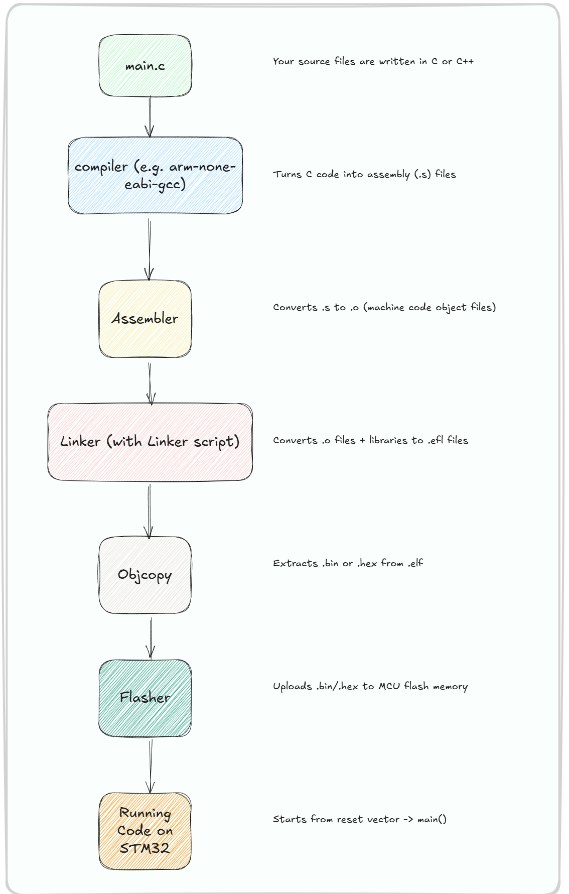
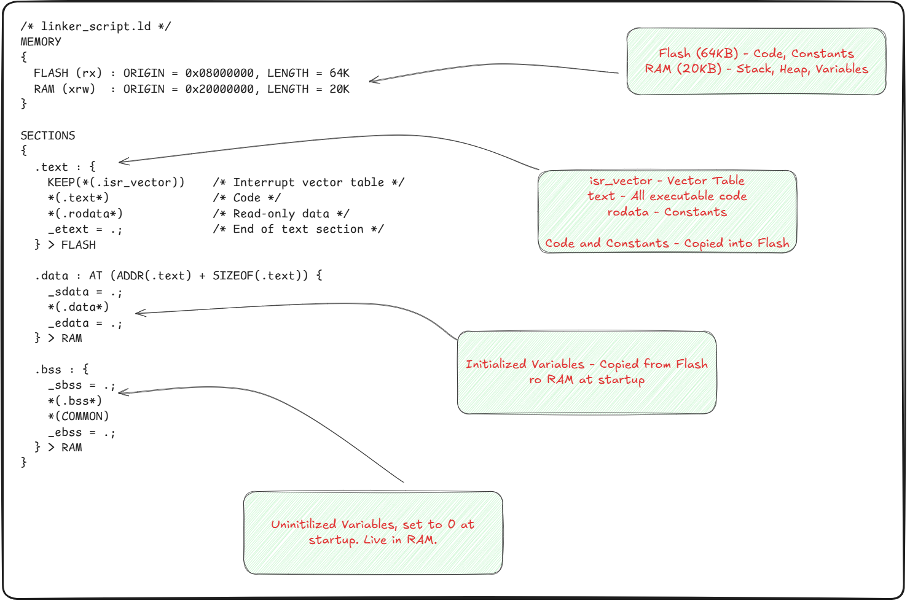
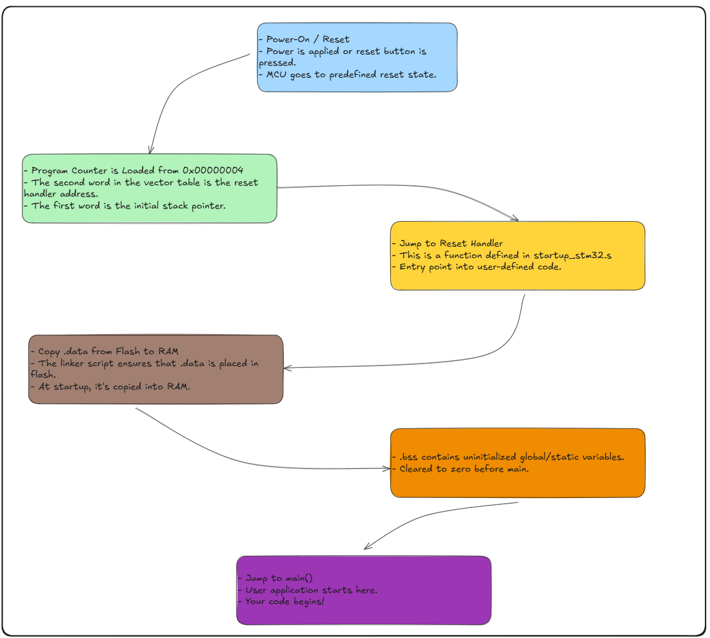
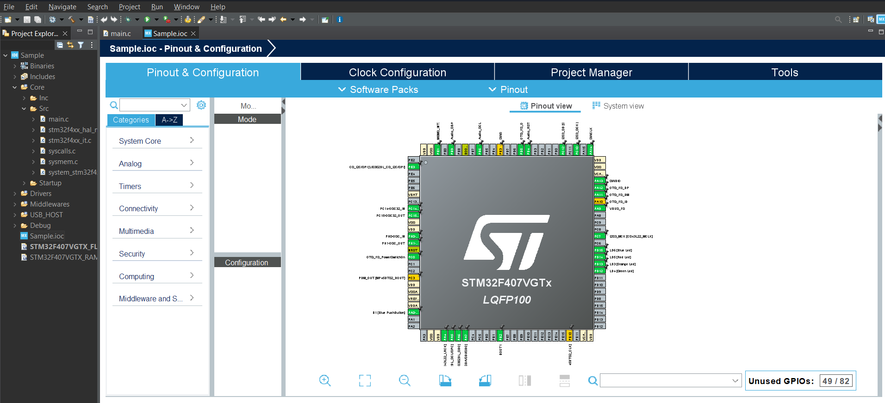
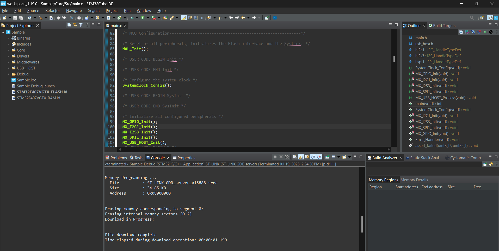

Navigation Menu:
[Learning Outcomes](Learning%20Outcomes)
[Part 1: Choosing a Microcontroller Family](P1%20-%20Choosing%20a%20Microcontroller%20Family.)
[Part 3: Introduction to the STM32CubeIDE](P3%20-%20Introduction%20to%20the%20STM32CubeIDE)
[Part 4: Becoming Familiar With the Embedded Workflow](P4%20-%20Becoming%20Familiar%20With%20the%20Embedded%20Workflow)
[Part 5: Embedded Engineering In Practice](P5%20-%20Embedded%20Engineering%20In%20Practice)

### Understanding Toolchains

If you've ever wondered how your C code turns into blinking lights and spinning motors, here's the scoop: there's a magical (and often confusing) chain of tools working behind the scenes to make that happen. This section pulls back the curtain.

---


*Figure: The embedded build process.*

---

### **To better visualize this process, I'll show you what the script we start with looks like at each stage of the build process.** 
## `main.c` 

```
// main.c

#define GPIOC_ODR (_(volatile unsigned int_)0x48000814)  
#define RCC_IOPENR (_(volatile unsigned int_)0x40021034)

void delay() {  
for (volatile int i = 0; i < 100000; ++i);  
}

int main(void) {  
RCC_IOPENR |= (1 << 2); // Enable GPIOC clock  
(_(unsigned int_)0x48000800) |= (1 << 13); // Set PC13 as output

while (1) {
    GPIOC_ODR ^= (1 << 13);         // Toggle PC13
    delay();
}
```

## `main.s`

Generated via:

```
arm-none-eabi-gcc -S -mcpu=cortex-m3 -mthumb main.c -o main.s
```

```
        .section .text
        .global main

main:
        LDR     r3, =0x40021034
        LDR     r2, [r3]
        ORR     r2, r2, #4
        STR     r2, [r3]

        LDR     r3, =0x48000800
        LDR     r2, [r3]
        ORR     r2, r2, #0x2000
        STR     r2, [r3]

loop:
        LDR     r3, =0x48000814
        LDR     r2, [r3]
        EOR     r2, r2, #0x2000
        STR     r2, [r3]

        MOV     r4, #0x186A0
delay_loop:
        SUBS    r4, r4, #1
        BNE     delay_loop

        B       loop

```

## `main.o`

Generated via:

```
arm-none-eabi-gcc -c -mcpu=cortex-m3 -mthumb main.c -o main.o
```

This is a binary file and not human readable, but you can inspect it using:

```
arm-none-eabi-objdump -d main.o
```

Which shows:

```
00000000 <main>:
   0:   4b05        ldr     r3, [pc, #20]   ; (0x18)
   2:   681a        ldr     r2, [r3, #0]
   4:   f042 0204   orr     r2, r2, #4
   ...
```

## `main.elf`

Generated via:

```
arm-none-eabi-gcc -mcpu=cortex-m3 -mthumb main.c -o main.elf -nostdlib -Tlinker_script.ld
```

This `.elf` contains:
- Machine Code
- Section Information
- Symbol & Debug Info
- Relocation Entries

You can inspect it using:

```
arm-none-eabi-objdump -d main.elf
```

## `main.bin` or `main.hex`

Generated via:

```
arm-none-eabi-objcopy -O binary main.elf main.bin
arm-none-eabi-objcopy -O ihex main.elf main.hex
```

.bin is used with STLink or OpenOCD:

```
st-flash write main.bin 0x08000000
```
## The Building Blocks of a Toolchain

Let’s break it down like a sandwich assembly line. Each part has a role:

1. **Compiler** (e.g., `arm-none-eabi-gcc`)

    This guy takes your human-readable code (`main.c`) and turns it into an object file full of instructions your MCU can understand — kind of like translating English into binary caveman speak.

    ```
    arm-none-eabi-gcc -c main.c -o main.o
    ```

    This doesn’t make a full program yet. Just chunks.

2. **Linker**

    Now the linker comes in and stitches all your chunks (`.o` files, libraries, etc.) together. It places them at specific memory locations based on a linker script — your blueprint.

    ```
    arm-none-eabi-ld main.o -T linker.ld -o firmware.elf
    ```

    You might not see this part often in an IDE, but it’s crucial. If your code’s like a city, the linker decides where the buildings go.


*Figure: Annotated linker script highlighting section purposes for embedded firmware developers.*

3. **Startup Code & Reset Vector**

When your MCU resets (e.g., after power-on), it needs to know where to start executing code. That’s handled by:

- A vector table (array of function pointers)
- Startup code (sets up the stack, memory init, etc.)

These files are usually generated for you by IDEs or template projects.


*Figure: The Reset Vector flow after MCU startup/Reset.*

4. **Debugger / Flasher** (e.g., OpenOCD, ST-Link, J-Link)

Once you’ve got your `firmware.elf` or `firmware.bin`, you need to actually get it onto the board. That’s where flashing tools come in.

Tools like:

- ST-Link Utility (Windows GUI)
- OpenOCD (CLI-style, flexible but intimidating)
- STM32CubeProgrammer (STM32’s modern flasher/debugger)

5. The IDE/Build Environment

Here's the glue that holds your whole experience together. IDEs take all the above steps and wrap them up in shiny buttons.

Some options:

| Tool            | MCU Families                | Notes                                               |
|-----------------|----------------------------|-----------------------------------------------------|
| STM32CubeIDE    | STM32 (ARM Cortex-M)       | Official, great for CubeMX and STM32                |
| PlatformIO      | Cross-platform             | VSCode-based, tons of community love                |
| Keil µVision    | ARM (commercial)           | Feature-rich, proprietary                           |
| MPLAB X IDE     | PIC, AVR                   | Microchip devices                                   |
| Arduino IDE     | AVR, RP2040, ESP32         | Training wheels, but easy to start                  |

**Why We're Going with STM32CubeIDE (For Now)**

Let’s be real — setting up raw toolchains, configuring Makefiles, debugging weird path issues, and crafting linker scripts from scratch sounds cool. But for someone new to embedded systems, it’s also a fast track to existential dread.


*Figure: This is what the CubeIDE looks like. You can configure pin functions using this neat interface, and build code off of your selections.*

Instead, we’re using STM32CubeIDE because:

- It’s free and officially supported by ST
- It supports STM32F07G (My Dev Board!)
- You can generate startup code and boilerplate with CubeMX
- It handles compilation, linkinchag, flashing, and debugging for you
- It’s GUI-based, so you can see registers, memory, and variables in real time


*Figure: CubeIDE console upon hitting "Run"*

---
### In Summary

Here’s what you should walk away with:

- A toolchain is a set of programs that convert your source code into something your MCU understands and can run.
- The core parts include a compiler, linker, startup code, and flasher/debugger.
- STM32CubeIDE is our tool of choice — because it’s practical, friendly, and lets you focus on learning embedded concepts instead of playing DevOps.

**Let’s fire up STM32CubeIDE and write the world’s smallest main() in the next section.**

---
