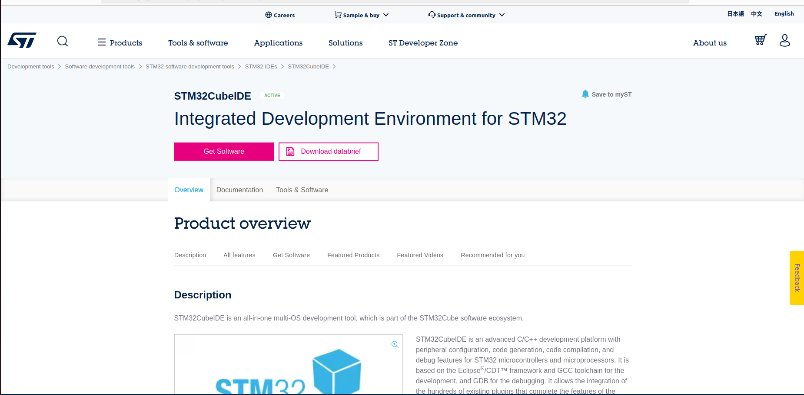
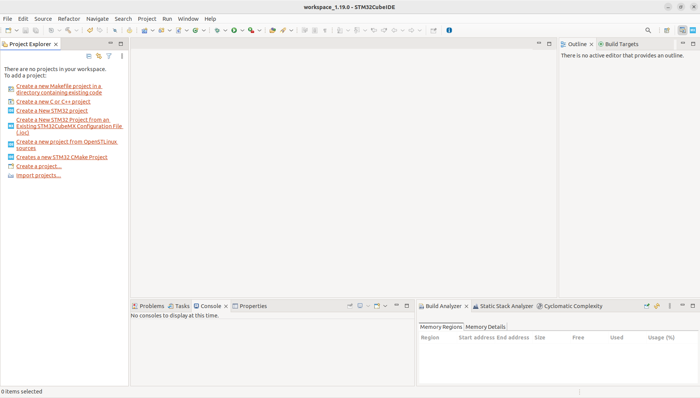
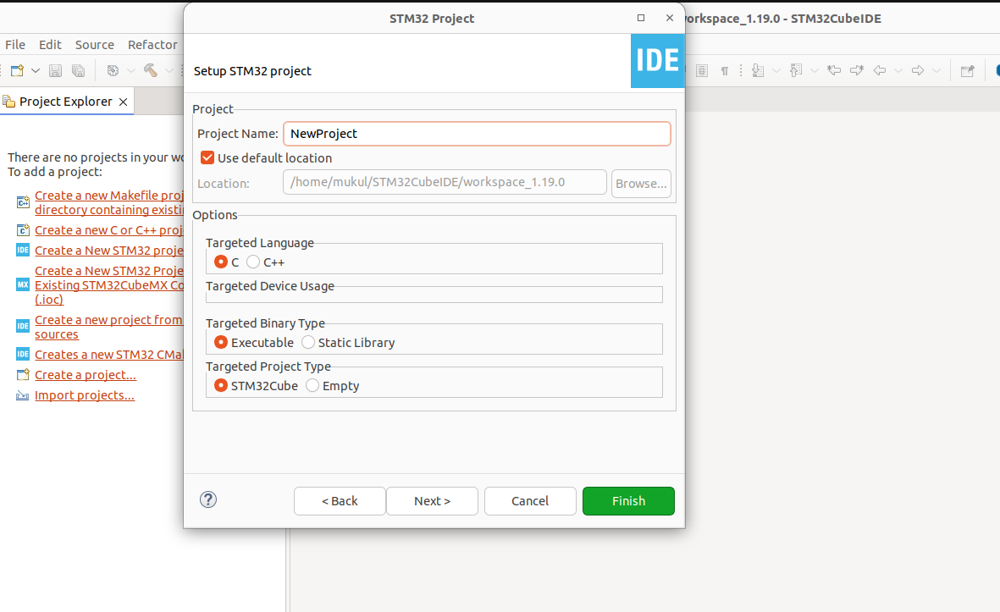
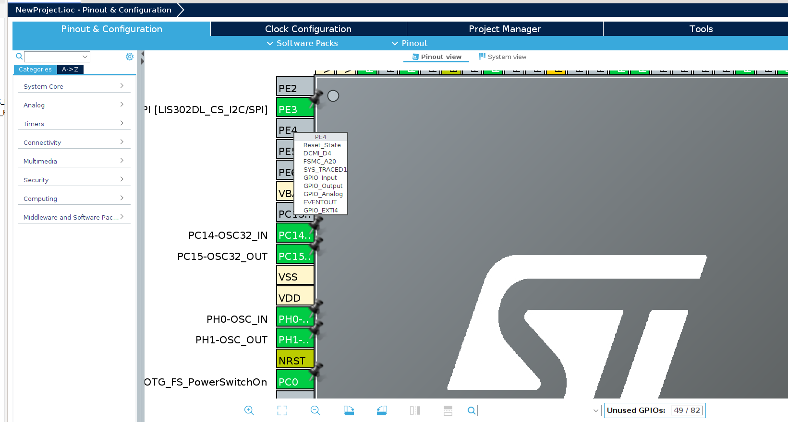
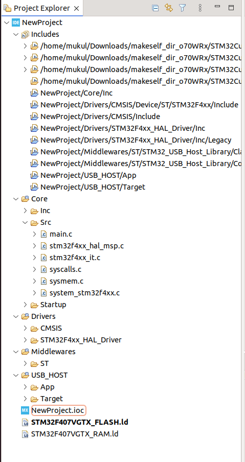
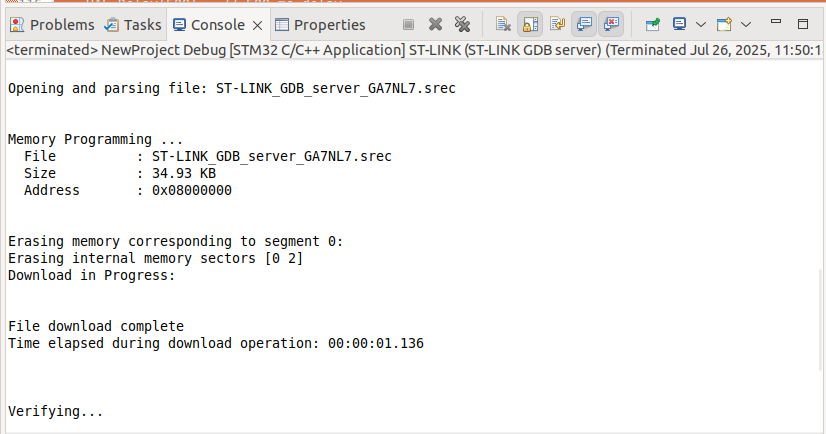
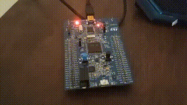

<h3>Navigation Menu</h3>
<ul>
  <li><a href="Learning%20Outcomes.md">Learning Outcomes</a></li>
  <li><a href="P1_Choosing%20a%20Microcontroller%20Family.md">P1 - Choosing a Microcontroller Family</a></li>
  <li><a href="P2_Introduction%20to%20the%20Embedded%20Toolchain.md">P2 - Introduction to the Embedded Toolchain</a></li>
  <li><a href="P4_Becoming%20Familiar%20With%20the%20Embedded%20Workflow.md">P4 - Becoming Familiar With the Embedded Workflow</a></li>
  <li><a href="P5_Embedded%20Engineering%20In%20Practice.md">P5 - Embedded Engineering In Practice</a></li>
</ul>
<h3>Supplementary Guides</h3>
<ul>
  <li><a href="Timer_PrescalerMath.md">Timer Math</a></li>
  <li><a href="Flashing%20The%20Blue%20Pill%20With%20A%20Cheap%20STLink%20Clone.md">Flashing The Blue Pill With A Cheap ST-Link Clone</a></li>
</ul>


Congratulations, dear reader. You now know what a toolchain is, you’ve heard rumors of compilers and linkers, and you’re wondering when the magic starts. Good news — we’re here.

This is your introduction to **STM32CubeIDE**, the all-in-one development environment that we’ll use to:

- **Generate project boilerplate**
- **Write embedded C code**
- **Build and flash firmware**
- **Debug what went wrong** (and it will go wrong, but that’s the fun part)

### What is STM32CubeIDE?

Think of STM32CubeIDE as a Swiss Army knife with rocket fuel. It bundles:

- **A powerful C/C++ editor**
- **The ARM GCC toolchain**
- **CubeMX:** a GUI to configure your microcontroller’s peripherals (clocks, pins, timers, etc.)
- **Build system**
- **Flashing + debugging tools**
- **A sleek interface that makes register peeking addictive**

### Installing the STM32CubeIDE


*Figure: The CubeIDE Landing Page. Link Below*
https://www.st.com/en/development-tools/stm32cubeide.html


*Figure: Download Options. I'm running on a Linux machine.*

1. Head to STMicroelectronics' official website
2. Download the STM32CubeIDE for your OS (Windows/macOS/Linux)
3. Run the installer (grab coffee, it’s a bit chunky)
4. Launch the IDE and bask in its Eclipse-powered glow

> **Note:** If Eclipse IDEs feel clunky to you, you’re not alone — but trust me, it’s worth it.

## Creating Your First Project (STM32F407)

Let's set the stage:

---
### 1. New STM32 Project

- **File → New STM32 Project**
- Pick your microcontroller manually: `STM32F070C8Tx` (or whatever variant your board uses)
- Give your project a nice name like `First_Blink` or `GODMODE_LED`


*Figure: This is what you see upon launching the CubeIDE (Save for a few pop ups).*


*Figure: When a new STM32 project is requested, the IDE prompts you to choose your dev board/ microcontroller.*

>**I am using ST's official Discovery board as opposed to any thrid party board. The "Blue Pill", which I've spoken about previously is not officially distributed by ST Microelectronics.**

>**If I was working with the Blue Pill, I would've chosen the MCU selector tab as opposed to the Board Selector.** 


*Figure: Type in your project name. You usually don't need to touch anything else here.*

### 2. Initialize Peripherals with CubeMX

- You’ll see a pinout and configuration screen
- Click a pin (e.g., PA5) and set it as `GPIO_Output`
- STM32Cube will auto-configure the relevant RCC and clock settings


Figure: This Discovery board is initialised with many a pin configured in their default state. You can change that by clicking on them and choosing what you'd like to do with them.

### 3. Generate Code

- Hit the gear icon
- Make sure "Generate under root" is checked
- Click "GENERATE" and boom — you’ve got a working project scaffold



*Figure: Perhaps it is now clear just how massive these project trees really are. All of this is to ensure you have an easy time simply writing your sketch for your application without worrying about the tortuous setup.*

## Understanding What Just Happened

CubeIDE just:

- Generated your `main.c`, `stm32f0xx_hal_gpio.c`, and other HAL boilerplate
- Set up a project structure that includes startup code, linker scripts, and vector tables
- Made it easy to start writing real code without having to touch `Makefiles` or compiler flags (for now)

---

## Writing Your First Rewarding Code

Let’s blink an LED like it owes us money. All you need to do is add 2 lines to the generated code. The On-board LED of my Discovery board already has the LEDs set to output by default. We don't have to think about tinkering with their configuration.

```
/* main.c */

//Find the while loop inside int main

while (1)

{

/* USER CODE END WHILE */

MX_USB_HOST_Process();

/* Toggle LED */

HAL_GPIO_TogglePin(GPIOD, GPIO_PIN_12);

HAL_Delay(500); // 500 ms delay
	
}
```

## Debugging & Flashing

1. Plug in your STM32 board via USB

2. Click the little "bug" icon in CubeIDE

3. Flashing will occur, your code will run, and your LED shall blink

4. If it doesn’t — welcome to embedded systems.



*Figure: Upon clicking "Run" from the upper menu.*



*And Away We Go*

### Peek Behind the Scenes

Curious about what's actually going on when you hit “run”? Here’s the short version:

- Your C code is compiled into a `.elf` binary
- The linker places it into flashable memory regions
- The debugger tool (via ST-Link or OpenOCD) pushes that code onto your MCU
- The reset handler jumps to `main()`, and off you go

### Learning Philosophy: Reward First, Mystery Later

You’ve just used STM32CubeIDE to blink an LED using hardware abstraction. That’s a win - and it's designed to be. From here, we’ll start pulling back the abstraction layers bit by bit. You’ll write:

- Direct register-level code
- Explore how the RCC and GPIO actually work
- Eventually, ignore the HAL entirely and roll your own drivers

## What You’ve Learned

- **STM32CubeIDE is your development cockpit** — use it to build, flash, and debug

- **CubeMX helps configure pins and peripherals** with just a few clicks

- **HAL lets you write functional embedded code quickly** (we’ll dig deeper later)

- **Getting that first LED to blink is your “hello world” moment** — savour it.

---