<h3>Navigation Menu</h3>
<ul>
  <li><a href="Learning%20Outcomes.md">Learning Outcomes</a></li>
  <li><a href="P1_Choosing%20a%20Microcontroller%20Family.md">P1 - Choosing a Microcontroller Family</a></li>
  <li><a href="P2_Introduction%20to%20the%20Embedded%20Toolchain.md">P2 - Introduction to the Embedded Toolchain</a></li>
  <li><a href="P3_Introduction%20to%20the%20STM32CubeIDE.md">P3 - Introduction to the STM32CubeIDE</a></li>
  <li><a href="P4_Becoming%20Familiar%20With%20the%20Embedded%20Workflow.md">P4 - Becoming Familiar With the Embedded Workflow</a></li>
</ul>
<h3>Supplementary Guides</h3>
<ul>
  <li><a href="Timer_PrescalerMath.md">Timer Math</a></li>
  <li><a href="Flashing%20The%20Blue%20Pill%20With%20A%20Cheap%20STLink%20Clone.md">Flashing The Blue Pill With A Cheap ST-Link Clone</a></li>
</ul>

You've just had your brain gently cooked learning how to configure microcontrollers at the register level. That was important. You saw the guts. But now, we're shifting gears.

Here's the deal: writing register-level code for every single peripheral is exhausting and impractical for most real-world projects.

HAL (Hardware Abstraction Layer) is your power tool. It's not perfect. It's not always elegant. But it helps you:

- Rapidly prototype and test ideas
- Focus on solving problems, not wiring registers
- Learn by doing, before obsessing over optimisation

> We will revisit register-level control in later modules when we start building our own drivers or optimising for speed/power. For now? HAL gives us speed and clarity.

## 1. Interrupts: The MCU's Reflexes

## Concept

Interrupts allow your MCU to respond immediately to external or internal events. Think button presses, sensor triggers, or timers firing.

### Example: Pushbutton-Triggered LED Toggle

**Objective:** Toggle between 4 colored LEDs when the push button is pressed. Use the external interrupt controller.

#### Setup Steps (STM32F407G):

1. Set GPIO pins PD12,PD13,PD14,PD15 to be outputs (They are outputs by default).
2. Setup a push button (PA0 in our case) to be GPIO_EXTI0
3. In the .ioc window: Pinout & Configuration -> System Core -> NVIC -> NVIC -> Check EXTI line 0 interrupt.

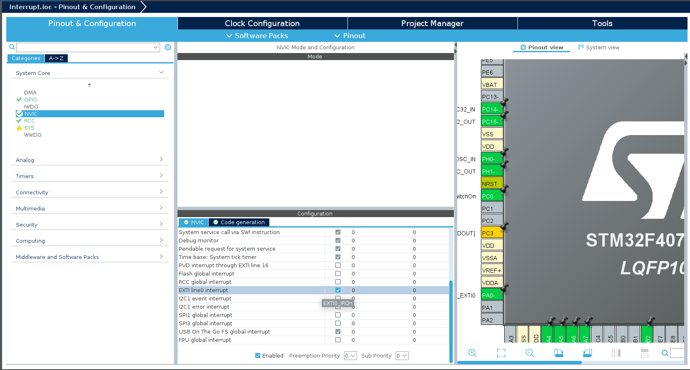
*Figure: EXTI0 Configuration*

5. Generate code.
6. Edit main.c

#### 1. Add Variables:

At the top of main.c, add:

```
#include "stm32f4xx_hal.h"
#include <stdint.h>

#define DEBOUNCE_DELAY 200    // debounce time in milliseconds

uint32_t last_interrupt_time = 0;
uint8_t ledState = 0;
const uint16_t led_pins[4] = {GPIO_PIN_12, GPIO_PIN_13, GPIO_PIN_14, GPIO_PIN_15};  // D12-D15

```

#### 2. Add an Interrupt Callback

```
void HAL_GPIO_EXTI_Callback(uint16_t GPIO_Pin)
{
    if (GPIO_Pin == GPIO_PIN_0) // PA0
    {
        uint32_t current_time = HAL_GetTick();
        if ((current_time - last_interrupt_time) > DEBOUNCE_DELAY)
        {
            // Turn off all LEDs first
            HAL_GPIO_WritePin(GPIOD, GPIO_PIN_12|GPIO_PIN_13|GPIO_PIN_14|GPIO_PIN_15, GPIO_PIN_RESET);
            // Light up next LED
            HAL_GPIO_WritePin(GPIOD, led_pins[ledState], GPIO_PIN_SET);
            ledState = (ledState + 1) % 4;  // Cycle through 0-3
            last_interrupt_time = current_time;
        }
    }
}

```

### What's going on above?

- The `HAL_GetTick()` function returns the system tick count in milliseconds.

- When the button interrupt fires, we check if enough time has passed since the last valid press using `DEBOUNCE_DELAY`. Only if it has, do we process the event and advance the LED color.

- Bounces (multiple interrupts during rapid mechanical movement of the button) within the 200ms debounce interval are ignored


**Build and Run. Here's what you'll see:


### What Can You Build With This?

- Emergency stop systems
- Human-machine interfaces
- Wake-on-sensor embedded systems

---
## 2. Timers: Embedded Timekeeping

### Overview

- **Objective:** Use Timer 2 to toggle an LED (e.g., PD13) every 1 second using an interrupt.
- **STM32 Peripherals Used:** Timer 2, GPIO, NVIC (interrupt controller)
- **Development Tool:** STM32CubeIDE

### Steps

#### 1. Hardware Connections

- Use any one onboard LED. For example, **PD13** (orange LED).   

#### 2. STM32CubeIDE Configuration

1. **Start a new STM32CubeIDE project** for the STM32F407VGTx.
2. **Configure PD13 as GPIO Output** (pinout configuration view).
3. **Enable Timer 2:**
    - Click on “TIM2” in the “Peripherals” tree.
    - Set the clock source to **Internal Clock**.
    - In the timer’s parameters, set:
        - **Prescaler:** 999
        - **Auto-Reload (ARR):** 83,999
        - This gives you a 1Hz trigger with 84MHz APB1 clock (84,000,000/1,000 = 84,000Hz timer, ARR 83,999 = 1s). Check out [this guide](Timer_PrescalerMath) to figure out how one sets timer parameters.
4. **Enable TIM2 global interrupt** in the NVIC tab (important for interrupt demonstration).

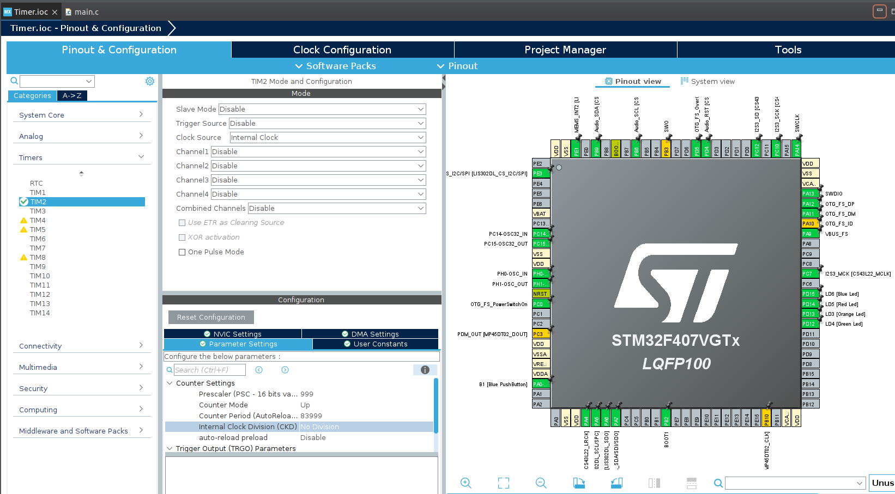
*Figure: Timer2 Config*
#### 3. Code Blocks

After generating the code, in `stm32f4xx_it.c`, you’ll find the interrupt handler:

```
void TIM2_IRQHandler(void)
{
    HAL_TIM_IRQHandler(&htim2);
}

```

STM32 HAL will call the following callback in `main.c`. Add (or complete) the function:

```
void HAL_TIM_PeriodElapsedCallback(TIM_HandleTypeDef *htim)
{
    if (htim->Instance == TIM2)
    {
        HAL_GPIO_TogglePin(GPIOD, GPIO_PIN_13); // Toggle PD13
    }
}

```

In `main.c`, after initialization but before your main loop, **start the timer in interrupt mode**:

```
HAL_TIM_Base_Start_IT(&htim2);
```

The main loop can stay empty because the timer interrupt handles the toggling.

```
while (1)
{
    // All done in interrupt, nothing needed here
}
```

#### Build and Run. You'll see:


## What This Shows

- Timers can generate precise time intervals—here, toggling an LED every 1s.
- No blocking `HAL_Delay()` or busy-wait needed; CPU is free for other tasks.
- The interrupt structure and callback model typical for production code.

## You Can Also Try

- Adjust blink rate by modifying ARR or prescaler for different timescales.   
- Try blinking multiple LEDs with multiple timers.
- Use other timer modes: **input capture**, **PWM output**, or **event counting**.

---
## 3. USART: Talking to the Outside World

#### 1. Configure USART2 in STM32CubeIDE

- In the .ioc configuration:
    - Enable **USART2** in "Asynchronous" mode.
    - **TX:** PA2, **RX:** PA3.
    - Set baud rate (e.g., 115200), word length: 8 bits, stop bits: 1, no parity, no hardware flow control.
- Under "NVIC Settings," enable "USART2 global interrupt."
- Save and generate code.

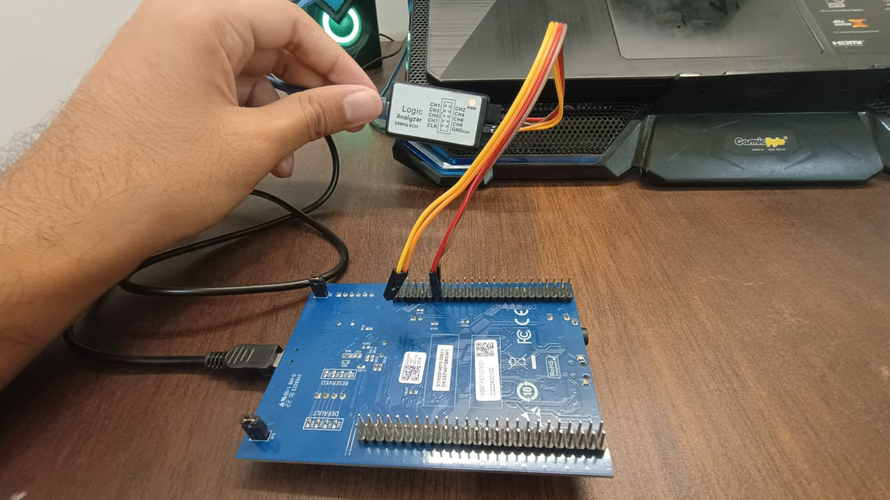
*I'll use this generic Logic Analyzer to probe the signals coming over the USART2 line.*

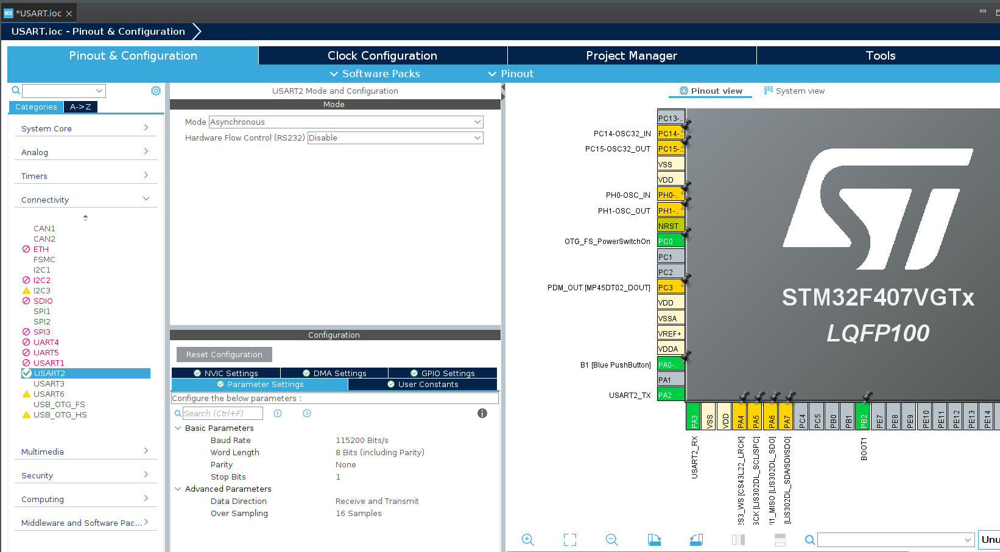
*Figure: UART2 Configuration In CubeIDE*

#### 2. Example Code

In `main.c`, add the following:

a. Include Variables

```
uint8_t rx_byte;
```

b. At the End of Initialization (just before the `while(1)` loop), Add:

```
// Transmit startup message
char *msg = "Systems Online\r\n";
HAL_UART_Transmit(&huart2, (uint8_t*)msg, strlen(msg), HAL_MAX_DELAY);

// Start UART reception in interrupt mode
HAL_UART_Receive_IT(&huart2, &rx_byte, 1);
```

Make sure `huart2` is the handle for USART2; it is auto-generated as a global variable by CubeIDE.

### c. Implement the UART Receive Callback

Add or modify this function in `main.c`:

```
void HAL_UART_RxCpltCallback(UART_HandleTypeDef *huart)
{
    if (huart->Instance == USART2)
    {
        // Echo the received byte
        HAL_UART_Transmit(&huart2, &rx_byte, 1, HAL_MAX_DELAY);
        // Receive next byte
        HAL_UART_Receive_IT(&huart2, &rx_byte, 1);
    }
}
```

### d. `while(1)` Loop

No code needed here; everything is handled by ISR/callbacks.

```
while (1)
{
    // Nothing needed
}
```

### Build & Run
### What Happens Now?

- **On power-up or reset**, "Systems Online" is sent over USART2.
- Any character sent from the PC terminal (e.g., PuTTY, Tera Term) is **echoed back**.
- Communication is fully interrupt-driven; the main loop is free for other code.

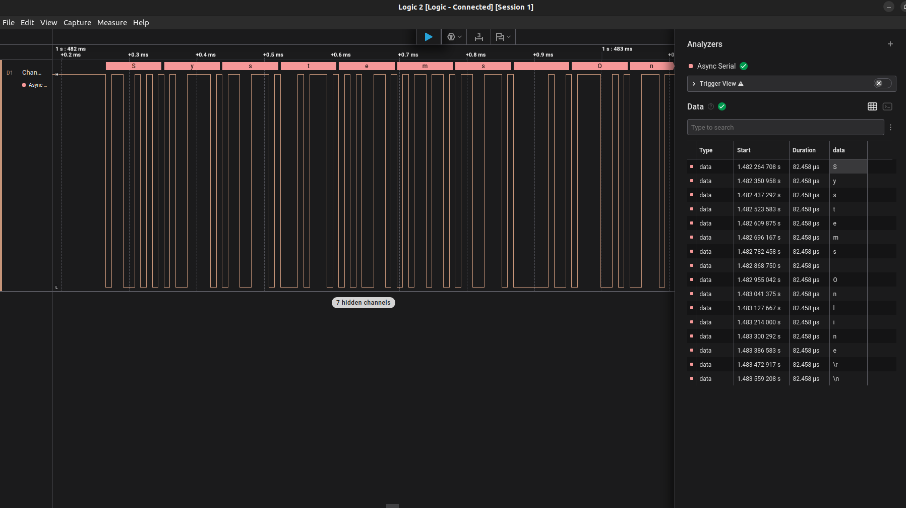
*Figure: "Systems Online" is sent over UART2 upon startup. It's kind of difficult to make it out here, but in the table on the right, we have "Systems Online" spelled out. *

## Notes

- Ensure the hardware connection:
    - Connect a USB-to-Serial interface (TX->PA3, RX->PA2, GND) to your PC if you use the onboard ST-LINK USB only for programming/debug, not for UART.    
- Open a terminal app with matching baud rate to observe the output.

---
## 4. I2C: Sensor and Peripheral Integration

### Concept

For this demonstration, I've used the MPU6050 6-Axis Inertial Measurement Unit. It's a rather popular module used in DIY aerial vehicle builds, or pretty much wherever we need to know a robot's orientation. 

It transmits information using the I2C protocol. I'll show you how we use HAL commands to extract raw accelerometer data from this unit, and send it out over a UART interface. Since I'm running Linux, I can simply view serial commands over the terminal. If you're on Windows, you'll need a terminal viewer like PuTTy; or you can just open up Arduino IDE's serial monitor. That'll work too.

This tutorial walks you through reading accelerometer data from the MPU6050 IMU sensor using an STM32F407 microcontroller over I2C, using STM32CubeIDE and HAL drivers.

### Pin Connections

| MPU6050 Pin | STM32F407 Pin  |
| ----------- | -------------- |
| VCC         | 3.3V           |
| GND         | GND            |
| SDA         | PB7 (I2C1_SDA) |
| SCL         | PB6 (I2C1_SCL) |

### Your .ioc Setup Will Involve These Steps:

1. **Enable I2C1 Peripheral**
   - Go to *Pinout & Configuration*.
   - Enable I2C1 in "I2C" mode.
   - Set PB6 as SCL and PB7 as SDA.

1. **Enable USART2 for Viewing Your Output
   - Enable USART2 in async mode.
   - Set PA2 (TX) and PA3 (RX).
   - Set baud rate to 115200.

3. **Project Settings**
   - Give your project a name.
   - Generate Code using default settings.

### Understand the MPU6050 Registers Before You Move On. 

The **MPU6050** uses I2C protocol and has the following relevant registers:

| Register     | Address (Hex) | Purpose             |
| ------------ | ------------- | ------------------- |
| WHO_AM_I     | `0x75`        | Returns device ID   |
| PWR_MGMT_1   | `0x6B`        | Wake up device      |
| ACCEL_XOUT_H | `0x3B`        | Start of accel data |
You can find more information about the MPU6050's registers from this reference manual:
[MPU6050 Reference Manual PDF](https://invensense.tdk.com/wp-content/uploads/2015/02/MPU-6000-Register-Map1.pdf)

To read the accelerometer, we read **6 consecutive bytes** starting at `0x3B`.

### MPU6050 HAL I2C Code (main.c)

#### 1. Define the MPU6050 Address and Buffers

```
#include "main.h"
#include "usb_host.h"
#include "stdio.h"

#define MPU6050_ADDR 0x68 << 1 // STM32 HAL uses 8-bit addr
#define WHO_AM_I_REG 0x75
#define PWR_MGMT_1 0x6B
#define ACCEL_XOUT_H 0x3B

I2C_HandleTypeDef hi2c1;
I2S_HandleTypeDef hi2s3;
SPI_HandleTypeDef hspi1;
UART_HandleTypeDef huart2;
  
uint8_t AccelData[6];
int16_t Ax, Ay, Az;
uint8_t data;
char msg[64];

void SystemClock_Config(void);
static void MX_GPIO_Init(void);
static void MX_I2C1_Init(void);
static void MX_USART2_UART_Init(void);
void MX_USB_HOST_Process(void);
```

#### 2. Initialise the MPU6050

```
void MPU6050_Init() {
	uint8_t check;
	uint8_t data;
	// Check WHO_AM_I
	HAL_I2C_Mem_Read(&hi2c1, MPU6050_ADDR, WHO_AM_I_REG, 1, &check, 1, HAL_MAX_DELAY);
	
	if (check == 0x68) {
		// Wake up MPU6050
		data = 0x00;
		HAL_I2C_Mem_Write(&hi2c1, MPU6050_ADDR, PWR_MGMT_1, 1, &data, 1, HAL_MAX_DELAY);
	} else {
		printf("MPU6050 not found! WHO_AM_I = 0x%X\r\n", check);
	}
}
```

#### 3. Read Raw Data From the MPU6050

```
void MPU6050_Read_Accel(int16_t* ax, int16_t* ay, int16_t* az) {
	
	uint8_t rec_data[6];
	
	HAL_I2C_Mem_Read(&hi2c1, MPU6050_ADDR, ACCEL_XOUT_H, 1, rec_data, 6, HAL_MAX_DELAY);
	
	*ax = (int16_t)(rec_data[0] << 8 | rec_data[1]);
	*ay = (int16_t)(rec_data[2] << 8 | rec_data[3]);
	*az = (int16_t)(rec_data[4] << 8 | rec_data[5]);
}
```

#### 4. Read and Send Data Over UART in `main.c`

```
int main(void) {
	HAL_Init();
	SystemClock_Config();
	MX_GPIO_Init();
	MX_I2C1_Init();
	MX_USART2_UART_Init();
	MPU6050_Init();
	
	int16_t ax, ay, az;
	
	while (1) {
			MPU6050_Read_Accel(&ax, &ay, &az);	
			printf("AX: %d, AY: %d, AZ: %d\r\n", ax, ay, az);
			HAL_Delay(500); // 2 Hz sampling
		}
}
```

#### 4. Redefine `printf`, so your stream can be seen over UART

```
int __io_putchar(int ch) {
	HAL_UART_Transmit(&huart2, (uint8_t*)&ch, 1, HAL_MAX_DELAY);
	return ch;
}
```

### Build and Run.
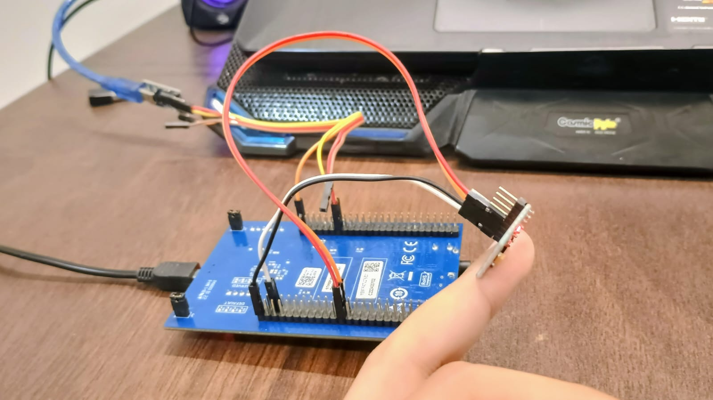

**Important: Unlike the Arduino, the STM32F4 does not have a USB-UART bridge built-in. What this means is - You'll need a USB-UART bridge to actually see any incoming UART data.

**In the previous experiment, I simply used the logic analyzer to gauge the UART2 line.

**Open a serial terminal to see your UART output. If you have the Arduino IDE, you can use *its* serial viewer too. 


*Figure: Raw Accelerometer Data. Don't worry about what this data means just yet.*

## What Can I Build With This?

- Orientation-sensing robot
- Wearable step counter
- Sensor fusion modules

---

## 5. SPI: High-Speed Peripheral Mastery

We're gonna build upon the previous experiment now. Here's the objective: Read raw values from the MPU6050 IMU via I2C (Use a BluePill as a **SPI Master**) -> convert those to estimated roll and pitch angles -> Transmit the pitch values to an **SPI Slave** (The Discovery Board) -> Visualize those values using a serial plotter.

Author's Note: Ooh boy, this experiment was a doozy to set up. Programming the BluePill is such a pain in the ass. You'll see. 

## Concept

SPI is a full-duplex, fast protocol for communication with displays, sensors, and memory.
I have none of these devices at hand right now, so'll simply transmit SPI messages from the Blue Pill to the Discovery board as described previously. 

## What We'll Need:

**- An STM32F103 BluePill & An ST-Link Programmer

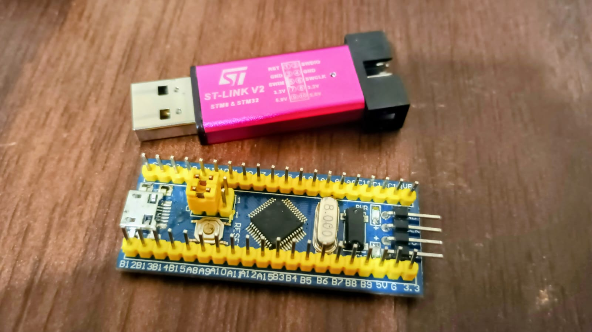

**- An MPU6050


**- An STM32F407 Discovery Board

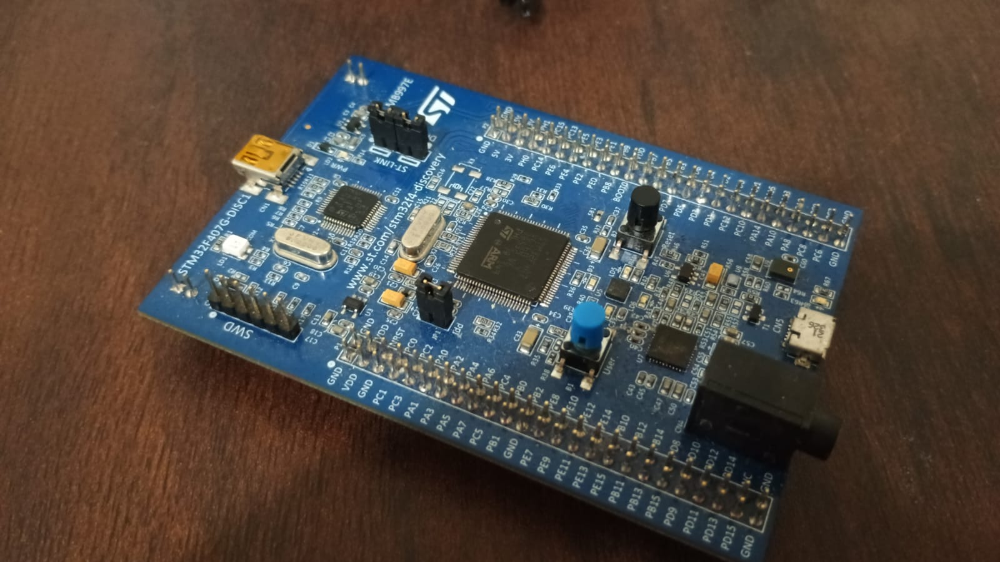

**- A USB-UART Bridge

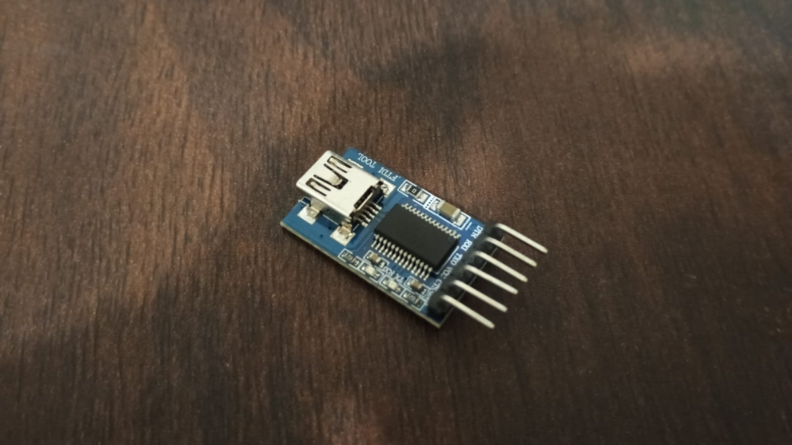

## Step 1: Read MPU6050 data on the Blue Pill:

On the Blue Pill, We'll use I2C to read data from the MPU6050 like in the previous experiment, but with the added effort of sending it over SPI to my Disc. board. 

## .ioc Setup: This'll be the most convoluted setup yet, so pay close attention!

- Now, I want the BluePill to read raw data from the IMU at a rock-solid 10Hz. How can I do this? I won't use any blocking functions like `HAL_Delay`. Having a defined timer interrupt is probably the most precise route. That's why I'll use BP's `Timer2` module. 
- Here, I'll fidget with BP's clock system to have the core run at a swift 72 MHz.
	- System Core -> RCC -> HSE -> Select Crystal/Ceramic Resonator (8 MHz)
	- Edit the clock configuration tab like in this image:
	
	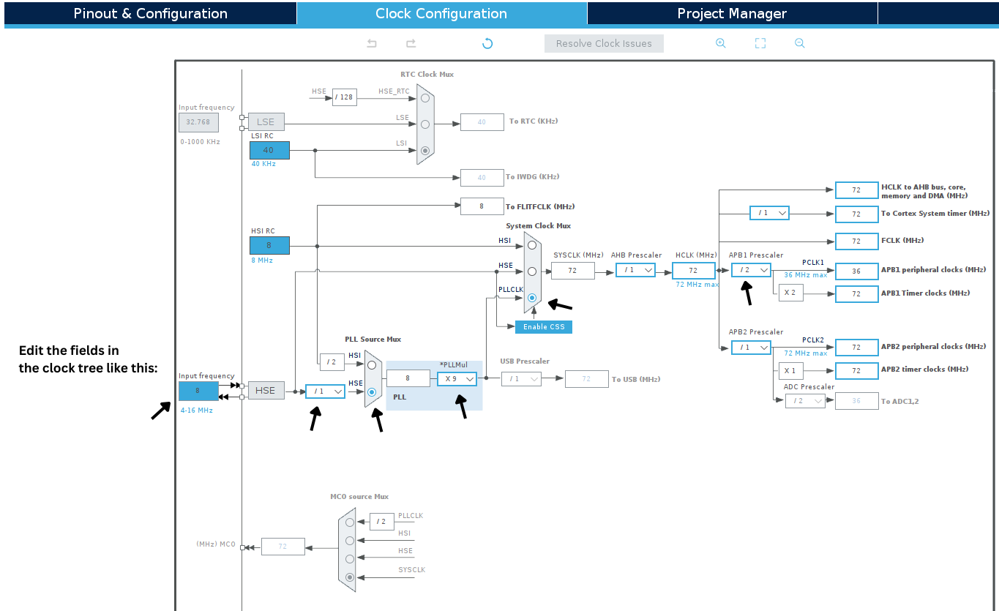

	- Edit the Timer2 Config like in this image. Note the Prescaler and Counter Period fields. Those values give us an interrupt every 100 miliseconds when the core's running at 72 MHz. The intervals are calculated according to [this expression.](Timer_PrescalerMath)
	- Enable the TIM2 global interrupt. 
	
	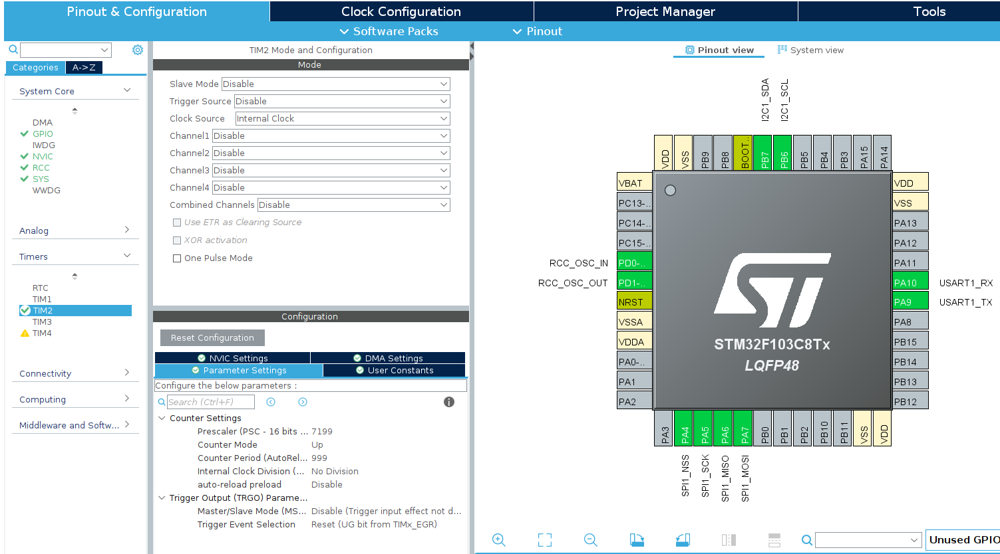

- Enable I2C1 with the default settings, and enable the I2C1 event interrupt.
- Enable SPI1
	- Mode: Full Duplex Master
	- Hardware NSS Signal: Hardware NSS Output Signal

We're done here. Generate Code.

## Hardware Connections

| MPU6050 Pin | STM32 BluePill Pin | Description                            |
| ----------- | ------------------ | -------------------------------------- |
| VCC         | 3.3V               | Power supply                           |
| GND         | GND                | Ground                                 |
| SCL         | PB6                | I2C1 SCL                               |
| SDA         | PB7                | I2C1 SDA                               |
| INT         | (Optional: PB5)    | Interrupt (optional, for advanced use) |
## The Blue Pill Sketch (Excluding the Setup Fluff)

```
#include "main.h"
#include "string.h"
#include "math.h"
#include "stdio.h"

#define MPU6050_ADDR     (0x68 << 1)  // Shifted for HAL
#define WHO_AM_I_REG     0x75
#define PWR_MGMT_1       0x6B
#define SMPLRT_DIV_REG   0x19
#define CONFIG_REG       0x1A
#define GYRO_CONFIG_REG  0x1B
#define ACCEL_CONFIG_REG 0x1C

I2C_HandleTypeDef hi2c1;
SPI_HandleTypeDef hspi1;
TIM_HandleTypeDef htim2;
UART_HandleTypeDef huart1;

int16_t Accel_X, Accel_Y, Accel_Z;
int16_t Gyro_X, Gyro_Y, Gyro_Z;

float roll = 0, pitch = 0;
const float alpha = 0.96;
const float dt = 0.1;  // 10Hz
char buffer[64];

// MPU6050 scaling
const float GYRO_SENS = 131.0;
const float ACCEL_SENS = 16384.0;

void SystemClock_Config(void);
static void MX_GPIO_Init(void);
static void MX_TIM2_Init(void);
static void MX_I2C1_Init(void);
static void MX_SPI1_Init(void);
static void MX_USART1_UART_Init(void);

uint8_t MPU6050_Init()
{
    uint8_t check, data;

    // Check device ID WHO_AM_I
    HAL_I2C_Mem_Read(&hi2c1, MPU6050_ADDR, WHO_AM_I_REG, 1, &check, 1, HAL_MAX_DELAY);
    if (check != 0x68)
        return 0;  // Failure

    // Wake up the sensor: write 0 to PWR_MGMT_1
    data = 0x00;
    HAL_I2C_Mem_Write(&hi2c1, MPU6050_ADDR, PWR_MGMT_1, 1, &data, 1, HAL_MAX_DELAY);

    // Optional: set sample rate divider to 0 (1kHz)
    data = 0x00;
    HAL_I2C_Mem_Write(&hi2c1, MPU6050_ADDR, SMPLRT_DIV_REG, 1, &data, 1, HAL_MAX_DELAY);

    // Optional: set DLPF config (e.g., 0x03 for 44Hz accel & 42Hz gyro)
    data = 0x03;
    HAL_I2C_Mem_Write(&hi2c1, MPU6050_ADDR, CONFIG_REG, 1, &data, 1, HAL_MAX_DELAY);

    // Optional: set Gyro range to ±250 deg/s (default)
    data = 0x00;
    HAL_I2C_Mem_Write(&hi2c1, MPU6050_ADDR, GYRO_CONFIG_REG, 1, &data, 1, HAL_MAX_DELAY);

    // Optional: set Accel range to ±2g (default)
    data = 0x00;
    HAL_I2C_Mem_Write(&hi2c1, MPU6050_ADDR, ACCEL_CONFIG_REG, 1, &data, 1, HAL_MAX_DELAY);

    return 1;  // Success
}

void MPU6050_Read_All()
{
    uint8_t data[14];
    HAL_I2C_Mem_Read(&hi2c1, MPU6050_ADDR, 0x3B, 1, data, 14, HAL_MAX_DELAY);

    Accel_X = (int16_t)(data[0] << 8 | data[1]);
    Accel_Y = (int16_t)(data[2] << 8 | data[3]);
    Accel_Z = (int16_t)(data[4] << 8 | data[5]);

    Gyro_X = (int16_t)(data[8] << 8 | data[9]);
    Gyro_Y = (int16_t)(data[10] << 8 | data[11]);
    Gyro_Z = (int16_t)(data[12] << 8 | data[13]);

    // Temporary UART debug
    //char dbg[64];
    //int len = snprintf(dbg, sizeof(dbg), "AX:%d AY:%d AZ:%d GX:%d GY:%d\r\n", Accel_X, Accel_Y, Accel_Z, Gyro_X, Gyro_Y);
    //HAL_UART_Transmit(&huart1, (uint8_t*)dbg, len, HAL_MAX_DELAY);
}

void Compute_Orientation()
{
    float ax = Accel_X / ACCEL_SENS;
    float ay = Accel_Y / ACCEL_SENS;
    float az = Accel_Z / ACCEL_SENS;

    float accel_roll  = atan2(ay, az) * 180 / M_PI;
    float accel_pitch = atan2(-ax, sqrt(ay * ay + az * az)) * 180 / M_PI;

    float gyro_roll_rate  = Gyro_X / GYRO_SENS;  // deg/s
    float gyro_pitch_rate = Gyro_Y / GYRO_SENS;

    // Complementary Filter
    roll  = alpha * (roll  + gyro_roll_rate * dt)  + (1.0 - alpha) * accel_roll;
    pitch = alpha * (pitch + gyro_pitch_rate * dt) + (1.0 - alpha) * accel_pitch;
}

void HAL_TIM_PeriodElapsedCallback(TIM_HandleTypeDef *htim)
{
    if (htim->Instance == TIM2)
    {
        MPU6050_Read_All();
        Compute_Orientation();

        //Optional: Send this data over USART1 if you so please
        int len = snprintf(buffer, sizeof(buffer), "Roll: %.2f, Pitch: %.2f\r\n", roll, pitch);
        HAL_UART_Transmit(&huart1, (uint8_t*)buffer, len, HAL_MAX_DELAY);

        //Send data over SPI
        uint8_t tx_data = (uint8_t)pitch;
        HAL_SPI_Transmit(&hspi1, &tx_data, 1, 100);
    }
}

int main(void)
{

  HAL_Init();
  SystemClock_Config();

  /* Initialize all configured peripherals */
  MX_GPIO_Init();
  MX_TIM2_Init();
  MX_I2C1_Init();
  MX_SPI1_Init();
  MX_USART1_UART_Init();

  if (!MPU6050_Init())
  {
      //char err[] = "MPU6050 not detected!\r\n";
      //HAL_UART_Transmit(&huart1, (uint8_t*)err, strlen(err), HAL_MAX_DELAY);
      while (1);
  }
  else
  {
      //char ok[] = "MPU6050 initialized.\r\n";
      //HAL_UART_Transmit(&huart1, (uint8_t*)ok, strlen(ok), HAL_MAX_DELAY);
  }

  HAL_TIM_Base_Start_IT(&htim2);  // Start Timer2 with interrupt

  while (1)
  {

  }
}

/// I've avoided pasting all the irrelevant setup code here. It's all autogenerated anyway. Everything below the main function is setup code and has thus been skipped from this code block.
```

Now remember, the Blue Pill does not have a programming module built-in like the Discovery board. We use an external ST-Link programmer to flash code onto Blue Pills.

### Build and upload. 
Unfortunately, the nice folks over at STMicroelectronics decided to make my life harder by fire-walling cheap ST-Link clones (which I happen to possess).

If you're okay with spending $30, you can find a genuine programmer [here.](https://www.st.com/en/development-tools/st-link-v2.html)

OR

Check out [this guide](Flashing%20The%20Blue%20Pill%20With%20A%20Cheap%20STLink%20Clone.md) to learn how you can flash your Blue Pill without the STM32CubeIDE.

### *Important note on flashing the BP
Before running the ST-Flash write, place your boot jumper to position 1 so that the BP can be pulled to its flash mode. When flashing is done, place the boot jumper back to position 0 and hit the reset button on the BP. The flashed binary will then start executing.

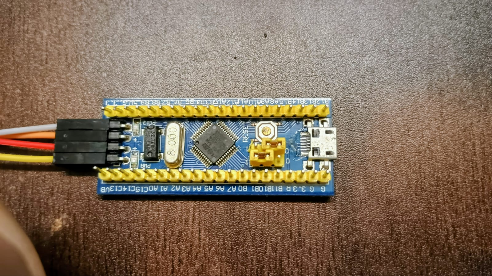
*Flash Mode*


*Run Mode*

See, I told you flashing the BP was a pain in the ass! If you get used to used it though, you'll come to appreciate just how powerful the BP can be.

## Step 2: Send Pitch Values Over SPI to My Discovery Board

## .ioc Config

- We'll need SPI1 and USART2 for this one.  
- Turn on SPI1 global interrupt. 

The setup here isn't nearly as tortuous as the one on the Blue Pill. We're not playing around with clocks and timers. 

## Hardware Connections

| Signal        | STM32 Discovery Pin | Blue Pill Pin | USB-UART Bridge (for Discovery) | Description                |
| ------------- | ------------------- | ------------- | ------------------------------- | -------------------------- |
| SPI1_NSS (CS) | PA15                | PA4           | -                               | Chip Select (SPI1)         |
| SPI1_SCK      | PA5                 | PA5           | -                               | Clock (SPI1)               |
| SPI1_MISO     | PA6                 | PA6           | -                               | Master-In Slave-Out (SPI1) |
| SPI1_MOSI     | PA7                 | PA7           | -                               | Master-Out Slave-In (SPI1) |
| GND           | GND (Any GND pin)   | GND           | GND                             | Common Ground              |
| 3.3V/5V       | 3.3V                | 3.3V/5V       | VCC                             | Power Supply               |
| USART2_TX     | PA2                 | -             | RX                              | UART transmit (from Disc.) |
| USART2_RX     | PA3                 | -             | TX                              | UART receive (to Disc.)    |
| GND           | GND (Any GND pin)   | -             | GND                             | UART ground                |

## The Discovery Board Sketch (Again, Excluding the Fluff)

```
#include "main.h"
#include "usb_host.h"
#include "string.h"
#include "math.h"
#include "stdio.h"

I2C_HandleTypeDef hi2c1;
I2S_HandleTypeDef hi2s3;
SPI_HandleTypeDef hspi1;
UART_HandleTypeDef huart2;

uint8_t spi_rx;

void SystemClock_Config(void);
static void MX_GPIO_Init(void);
static void MX_I2C1_Init(void);
static void MX_I2S3_Init(void);
static void MX_SPI1_Init(void);
static void MX_USART2_UART_Init(void);
void MX_USB_HOST_Process(void);

void HAL_SPI_RxCpltCallback(SPI_HandleTypeDef *hspi) {
    if (hspi->Instance == SPI1) { // Adjust if your SPI is different
        // Forward received value to serial plotter via USART
        char buf[16];
        snprintf(buf, sizeof(buf), "%d\r\n", spi_rx);
        HAL_UART_Transmit(&huart2, (uint8_t*)buf, strlen(buf), 100);
        // Restart SPI interrupt for next byte
        HAL_SPI_Receive_IT(&hspi1, &spi_rx, 1);
    }
}

int main(void)
{

	HAL_Init();
	SystemClock_Config();
	MX_GPIO_Init();
	MX_I2C1_Init();
	MX_I2S3_Init();
	MX_SPI1_Init();
	MX_USB_HOST_Init();
	MX_USART2_UART_Init();
	HAL_SPI_Receive_IT(&hspi1, &spi_rx, 1); // Non-blocking, triggers interrupt on complete

	while (1)
	  {
		MX_USB_HOST_Process();
	  }
}
```

### Build & Run. Power everything up. 

Here's what everything put together looks like. Yeah, its kind of a mess, but none of these components are breadboard friendly, so I'm stuck with this.

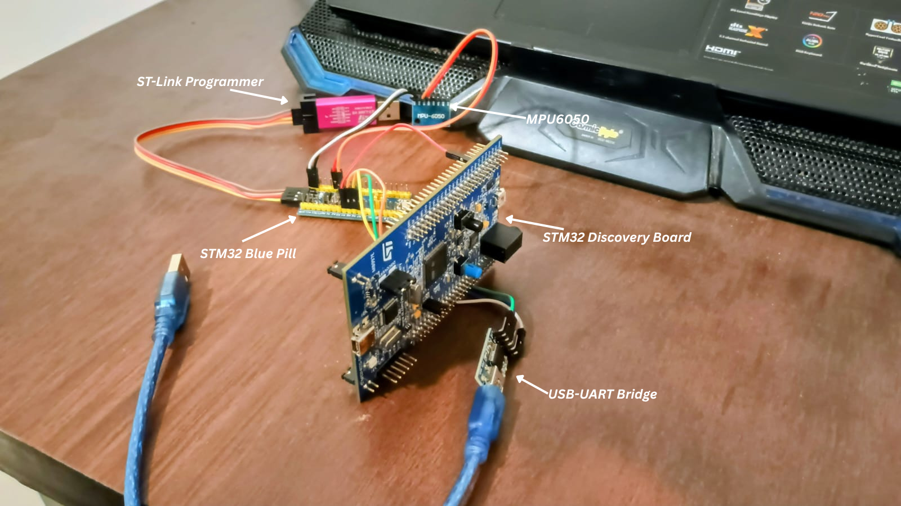 

And here's what the Pitch Value looks like after having gone through this chain. It's noisy and not super accurate, but hey: we don't care about that right now.


*Serial Plotter*
## What Can You Build With This?

- Real-time visual feedback
- Graphical interfaces
- High-speed sensor systems

---

## 6. ADC: Reading the Analogue World

### Concept

An **Analog-to-Digital Converter (ADC)** on the STM32 Blue Pill takes a continuously varying voltage (analog signal) from a pin—such as from a potentiometer—and transforms it into a digital value that the microcontroller can use in software.

- The ADC acts like a ruler for voltage: it measures the input voltage level (between 0V and the board’s reference, typically 3.3V on a Blue Pill) and assigns it a number.
- The Blue Pill’s 12-bit ADC divides the voltage range into 4,096 steps (from 0 to 4,095).
    - 0 represents 0V, and 4,095 represents the reference voltage (usually 3.3V).
- When you turn a potentiometer connected to the ADC input, the voltage you produce is “sampled” and converted into a digital number, letting your code see and respond to real-world changes.
- This process happens quickly and repeatedly, letting the STM32 monitor analog sensors, sliders, or voltages in real time.

### Pin Connections

| Signal               | Blue Pill Pin | Potentiometer Pin         | Description                             |
| -------------------- | ------------- | ------------------------- | --------------------------------------- |
| Analog Input (ADC)   | PA0           | Pot wiper (center pin)    | Reads analog voltage from potentiometer |
| 3.3V                 | 3.3V          | Pot end 1                 | Potentiometer high/reference voltage    |
| GND                  | GND           | Pot end 2                 | Potentiometer low/ground                |
| USART1_TX            | PA9           | To USB-Serial RX          | Serial transmit (data sent to PC)       |
| USART1_RX (optional) | PA10          | (not required if only TX) | Serial receive (not used in this demo)  |
| GND (serial)         | GND           | USB-Serial GND            | Ground reference for UART/phsyical PC   |
- Connect PA0 to the potentiometer's wiper (center pin).
- Connect one potentiometer end to 3.3V and the other to GND.
- Connect PA9 to your USB-serial adapter RX pin, and GNDs together.
- PA10 connection is only needed if receiving data; for sending only, you may leave it unconnected.
- Ensure all grounds (pot, Blue Pill, USB-serial) are tied together.

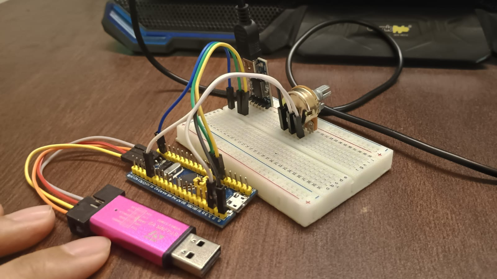

### .ioc Setup

#### 1. **Create a New Project**
- Open STM32CubeIDE.
- Click **File → New STM32 Project**.
- Select **Blue Pill MCU**: STM32F103C8Tx (or your specific microcontroller).
- Name your project and confirm.

#### 2. **Pinout Configuration**
- In the .ioc **Pinout & Configuration** view:
  - **Select PA0**: Click PA0 and assign as **ADC1_IN0** (Analog input).
  - **Select PA9**: Click PA9 and assign as **USART1_TX**.
  - **Optional: PA10** as **USART1_RX** (not required if only transmitting).

#### 3. **Configure Peripherals**
- **ADC1**
  - Go to the **Peripherals Tree** → **ADC1** → expand.
  - Enable **IN0** (should already be checked by the pinout step).
  - In the **Configuration** tab (on the right panel):
    - Set **Mode**: "Single-ended".
    - Set **Scan Conversion Mode**: "Disable" (if only one channel).
    - Set **Continuous Conversion Mode**: "Enable" (Optional: for continuous reads).
    - Set **Data Alignment**: "Right".
    - Sampling time: Usually 55.5 Cycles or higher for reliable reading from a potentiometer.

- **USART1**
  - In the **Peripherals Tree** → **USART1**.
  - Set **Mode** to "Asynchronous".
  - **Baud Rate**: 115200 (or your preference).
  - **Word Length**: 8 Bits.
  - **Parity**: None.
  - **Stop Bits**: 1.

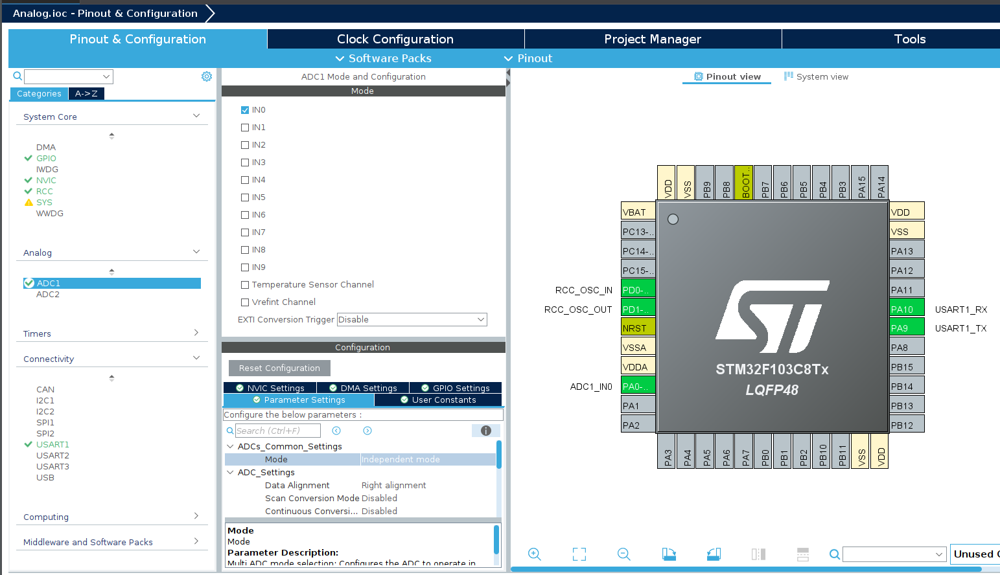
*ADC Configuration*
#### 4. **Clock Configuration**
- Click the **"Clock Configuration"** tab.
- Set input clock (HSE or HSI as appropriate).
- Ensure ADC and USART1 are both getting valid clocks (default settings for Blue Pill usually work).

#### 5. **Project Settings and Code Generation**
- Click **"Project Manager"** tab.
- Set name, toolchain, and locations as needed.
- Click **"GENERATE CODE"** at the top right.


### Code Blocks

#### 1. **Includes and Handles**

- `ADC_HandleTypeDef hadc1;`  
  Handle structure for ADC1 peripheral, used to configure and control ADC operations.

- `UART_HandleTypeDef huart1;`  
  Handle structure for USART1 peripheral, used to transmit serial data.

#### 2. **Helper Function**

```
float adc_to_voltage(uint16_t adc_value) {  
	return ((float)adc_value * 3.3f) / 4095.0f;  
}
```


- Converts the raw ADC digital value (0 to 4095 for 12-bit ADC) into a corresponding voltage assuming a 3.3V reference voltage.
- This helps to interpret the ADC reading in terms of actual voltage.

#### 3. **Main Program Flow**

```
HAL_Init();  
SystemClock_Config();  
MX_GPIO_Init();  
MX_ADC1_Init();  
MX_USART1_UART_Init();

char msg;  
uint16_t adc_val;  
float voltage;

while (1) {  
	
	HAL_ADC_Start(&hadc1); // Start ADC conversion  
	if (HAL_ADC_PollForConversion(&hadc1, 100) == HAL_OK) {  
	adc_val = HAL_ADC_GetValue(&hadc1); // Read ADC converted value  
	voltage = adc_to_voltage(adc_val); // Convert to voltage  
	int len = snprintf(msg, sizeof(msg), "ADC: %u, Voltage: %.3fV\r\n", adc_val, voltage);  
	HAL_UART_Transmit(&huart1, (uint8_t*)msg, len, 100); // Send string via USART1  
	}  
	
	HAL_Delay(300); // Wait 300ms before next read  
}
```


- **Initialization:**  
  - `HAL_Init()` initializes the Hardware Abstraction Layer and system timer.  
  - `SystemClock_Config()` sets up the MCU clocks (config generated by CubeIDE).  
  - `MX_GPIO_Init()`, `MX_ADC1_Init()`, and `MX_USART1_UART_Init()` initialize GPIO, ADC1, and USART1 peripherals respectively (generated by CubeIDE).

- **Main loop:**  
  - Starts ADC conversion.  
  - Waits (polls) for conversion to complete with 100ms timeout.  
  - Reads the ADC value from ADC data register.  
  - Converts ADC value to voltage for human-readable output.  
  - Uses `snprintf` to format the ADC value and voltage into a string buffer.  
  - Transmits the formatted string via USART1.  
  - Delays 300 milliseconds before the next reading to avoid flooding the serial output.

### Build and Run (Again, Flashing the BP Sucks),

Open Up a Serial Terminal
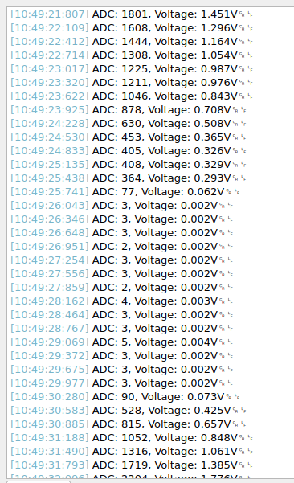

You can modify this example to add features like interrupt-driven UART, or data logging based on ADC input.

---

## 7. PWM: Precision Output

### Concept

- **Pulse Width Modulation (PWM)** allows you to encode analog values using the width of digital pulses, by rapidly toggling an output pin between high and low at a fixed period (frequency), but changing the ON time (duty cycle).
   
- **Duty cycle** is the ratio of the ON time to the total period, expressed as a percentage (0% to 100%).

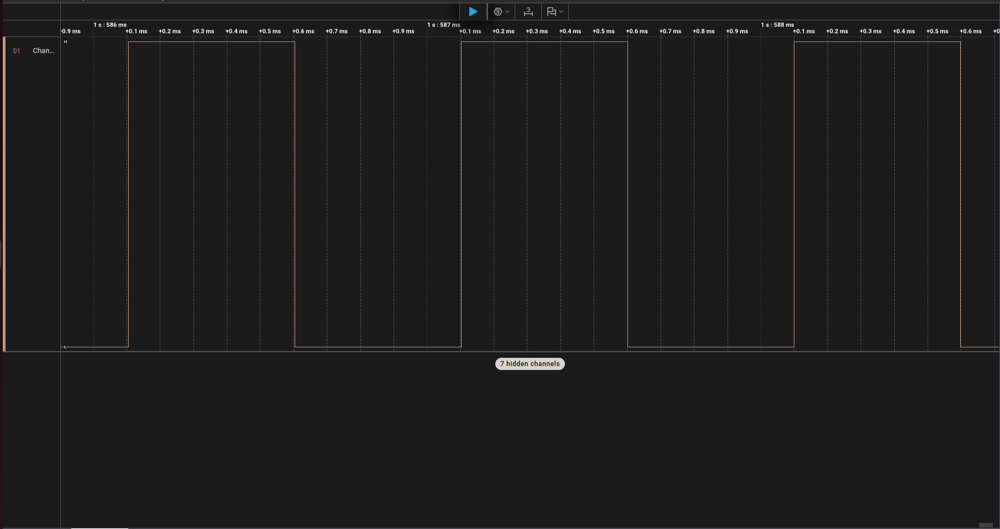
*1KHz, 50% Duty Cycle

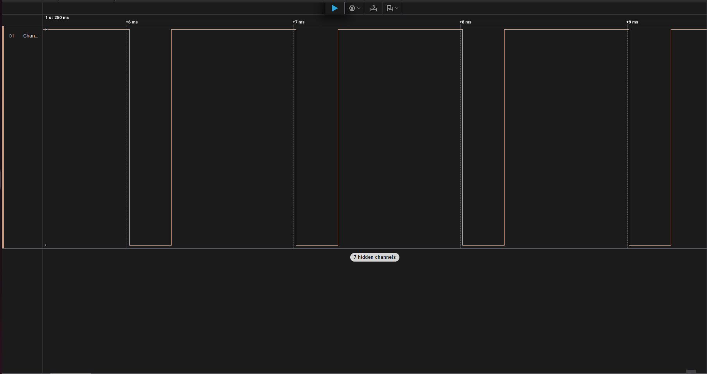
*1KHz, 75% Duty Cycle

- In this experiment, the duty cycle is continuously varied—forming a ramp or sawtooth pattern—which can be visualized using a logic analyzer.

### Pin Connections

- **PWM Output Pin:** By default, **TIM2_CH1** maps to **PA0. 

- **Logic Analyzer:** Connect a logic analyzer probe to PA0 (you may ground one probe to a board GND pin).

### .ioc Setup

#### a. **Start a New Project**

- Open CubeIDE → File > New STM32 Project.
- Select “STM32F407VGTx” or your STM32F4 Discovery variant.

#### b. **Pin Configuration**

- Click **Pinout & Configuration**.
- Find **PA0**, and select “TIM2 Channel 1” to enable the PWM function on that pin. It should automatically map to “TIM2_CH1”.

#### c. **Timer Setup**

- Under **“Timers” > TIM2**, click “Mode” and select “PWM Generation Channel 1”.
- In **Configuration**:
    - **Prescaler**: e.g., 83
    - **Counter Period**: e.g., 999
        - With a default 84MHz clock: PWM frequency = 1kHz.
        - Adjust as desired.
    - **Pulse**: Set initial value to 0 (start at zero duty; will change in code).
    - Enable Auto-Reload Preload


*Timer 2 PWM Configuration

### Code Blocks

Open `main.c`. Your logic will go in the areas marked `/* USER CODE BEGIN X */`.

#### a. **Start the PWM**

Add this after initialization but before entering the main loop:
```
/* USER CODE BEGIN 2 */
HAL_TIM_PWM_Start(&htim2, TIM_CHANNEL_1);
/* USER CODE END 2 */
```

#### b. **Varying the Duty Cycle Continuously**

Insert this in your main loop:
```
/* USER CODE BEGIN WHILE */
uint32_t pwm_period = __HAL_TIM_GET_AUTORELOAD(&htim2); // Typically 999
while (1)
{
    // Ramp up
    for (uint32_t duty = 0; duty <= pwm_period; duty += 1) {
        __HAL_TIM_SET_COMPARE(&htim2, TIM_CHANNEL_1, duty);
        HAL_Delay(1); // Adjust speed of variation here
    }
    // Ramp down
    for (uint32_t duty = pwm_period; duty > 0; duty -= 1) {
        __HAL_TIM_SET_COMPARE(&htim2, TIM_CHANNEL_1, duty);
        HAL_Delay(1);
    }
}
/* USER CODE END WHILE */
```

This ramp system smoothly varies the duty cycle from 0% up to 100% and back down, creating a “fading” PWM output: ideal for logic analyzer visualization.

### **Build and Run

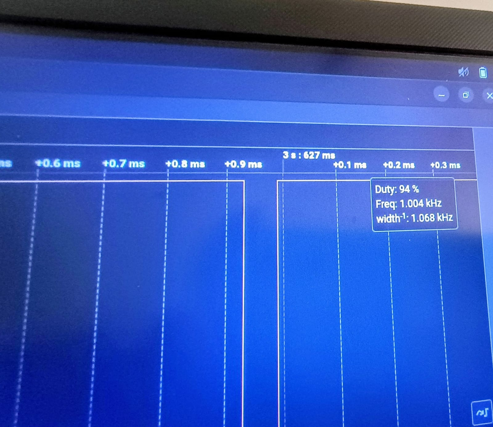
*At t = 627 ms, Duty Cycle = 94%

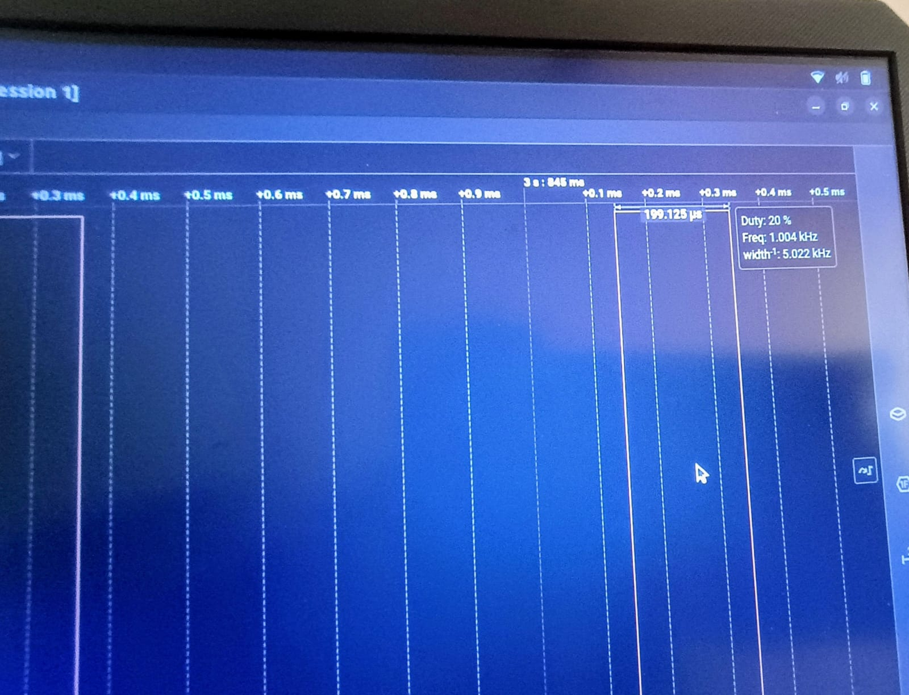
*At t = 845 ms, Duty Cycle = 20%

## What Can You Build With This?

- Motor driver
- LED brightness dimmer
- Servo controller

---
## After 7 of these experiments, here's a summary:

You've now touched almost every core peripheral you'll encounter in embedded systems. You didn't just learn *how* to use them. You learned *why*, and more importantly, *what for*.

- We started with a simple external interrupt to toggle LEDs on the discovery board. 
- We then saw how timers can be used to generate interrupts. We blinked an LED using timer interrupts.
- Next, we learned how to communicate with external devices using the USART/UART protocol. 
- To demonstrate I2C, we read raw data from an IMU and sent it over USART to a serial terminal.
- We then integrated SPI into the previous setup, using it to send data across 2 STM devices (Blue Pill/STM Disc.) and plotted estimated pitch values on a serial plotter. Here, you also saw how to program the Blue Pill.
- To understand how MCUs read the analog world around them, we set up a potentiometer.
- Finally, we learned what PWM works, and saw a bunch of example waveforms.

**Coming Next:**

- Writing basic drivers from scratch
- Thinking like a systems engineer
- Making your own custom PCB

*HAL will remain your sword for now. But you'll soon be forging your own.*

---